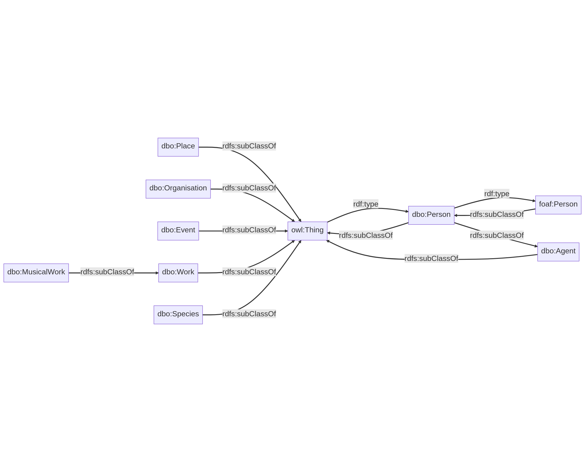
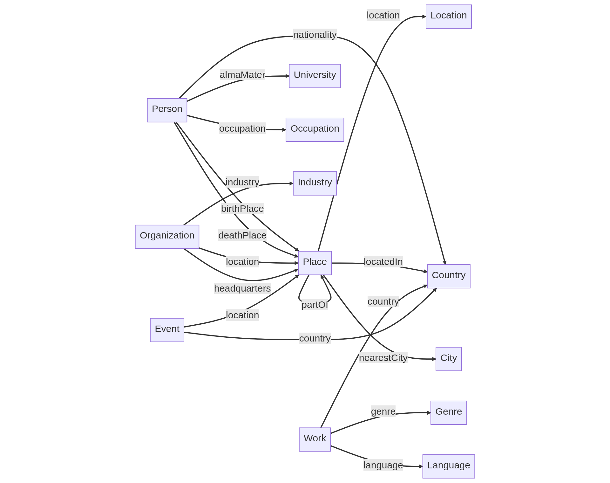

# Knowledge Graph Exploration - visual overview over DBPedia concepts

This folder contains the conversation with ChatGPT for each of the following prompts in the DBPedia exploration use case.
The dialogues can be found [here](./dbpedia_prompt_6) (prompt 6) and [here](./dbpedia_prompt_7) (prompt 7)

Further we put png and svg files next to the markdown files which show the rendered mermaid content of the best answers.

## Prompt 6

```
Can you create me a visualization showing the most important classes and concepts and how they are linked for dbpedia ontology, serialized for mermaid?
```



## Prompt 7

```
Can you create me a visualization of the most common concepts of the DBpedia ontology and their connections focusing on domain and range defined in properties.
```

