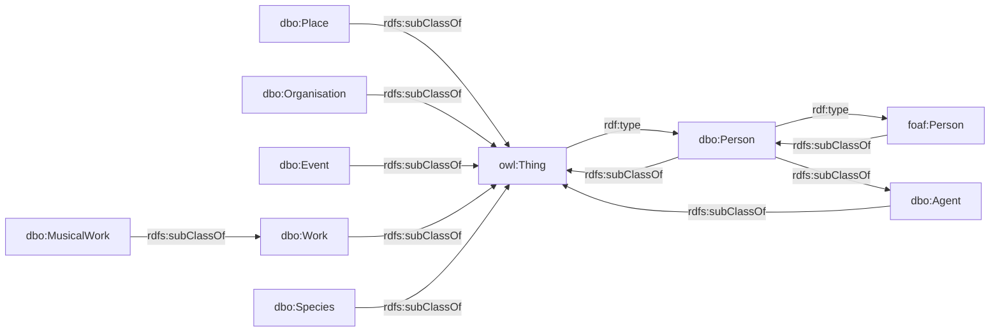

> We: Can vou create me a vizualization showing the most important classes and concepts and how they are linkes for dbpedia ontology serialized for mermaid?

> ChatGPT Sure! Here's an example visualization of the most important classes and concepts in the DBpedia ontology, serialized for Mermaid:

> ChatGPT: In this visualization, the owl:Thing class is at the top, representing the most general concept in the DBpedia ontology. The dbo:Person and foaf:Person classes are linked to the owl:Thing class, indicating that they are sub-classes of this most general class. Similarly, other important classes like dbo:Place, dbo:Organisation, dbo:Event, dbo:Work, dbo:Species, and dbo:MusicalWork are also linked to owl:Thing, indicating their hierarchical relationships within the ontology.  
Note that the visualization is based on a partial selection of the ontology, and you can modify it according to your needs. Also, make sure to check the compatibility of the Mermaid syntax with your platform.