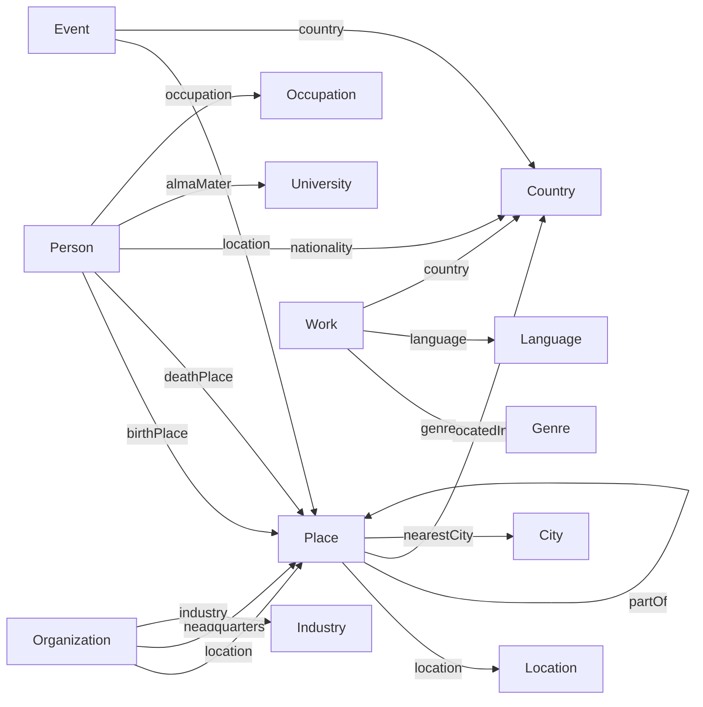
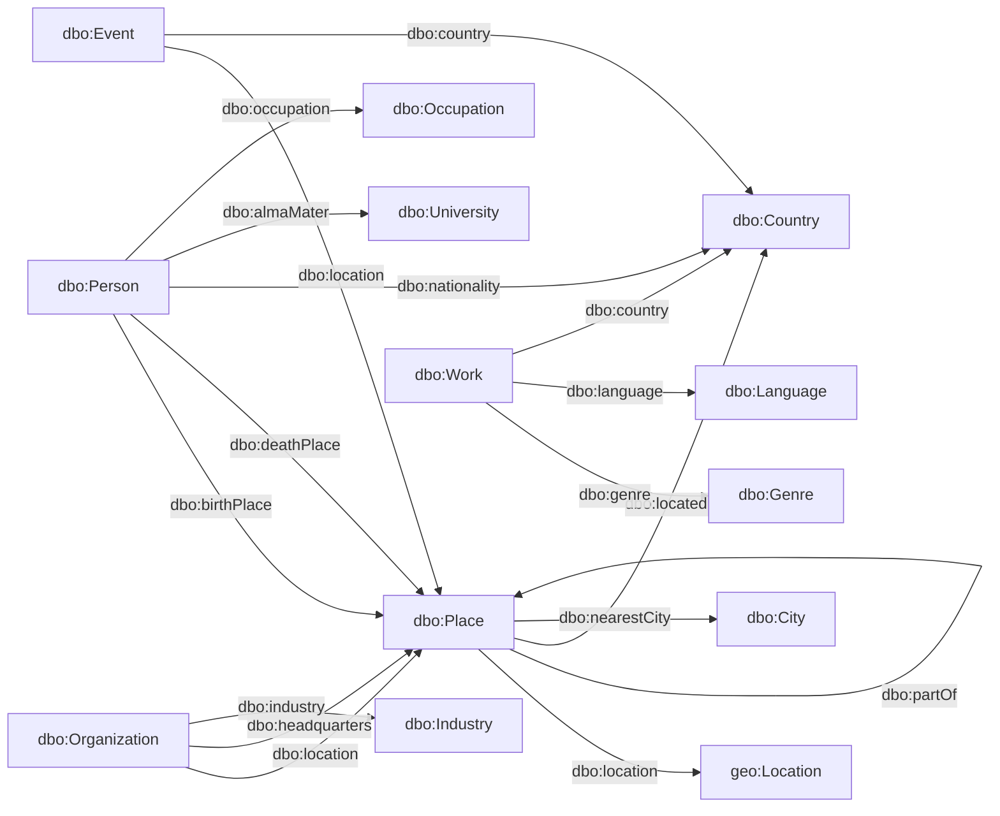

# Prompt 7 - Classes and concepts of DBpedia focussing on domain and range

> We: Can you give me a visualization of the most common concepts of the dbpedia ontology and their connections focussing on domain and range defined in properties?

> ChatGPT: Sure, I can provide you with a visualization of the most common concepts of the DBpedia Ontology and their connections, focusing on domain and range defined in properties.
 
Here is a visualization of the DBpedia Ontology using the property domain and range relationships. Each node represents a concept in the ontology, and each edge representskeine Bezeichnung, einfaches Label, Labeln in Prefix-Schreibweise a property with a specified domain and range. The thickness of the edge corresponds to the frequency of the property in the ontology.
 
DBpedia Ontology visualization
 
As you can see, the ontology is divided into several main categories, such as Person, Place, Organization, Event, and Work, each represented by a different color. The most common properties are connected to multiple categories, indicating that they are used across various domains.
 
For example, the property "location" connects the categories Place and Event, indicating that it is used to describe both the location of a place and the location of an event. Similarly, the property "birthPlace" connects the categories Person and Place, indicating that it is used to describe the birthplace of a person and the location of a place.
 
This visualization provides a useful overview of the DBpedia Ontology and its connections, highlighting the relationships between concepts and the properties used to describe them. 

> We: Can you draw me a diagram for mermaid of that?

> ChatGPT: Sure, here's a Mermaid diagram of the DBpedia Ontology, focusing on the domain and range of properties:

> In this diagram, each node represents a concept in the ontology, and each arrow represents a property with a specified domain and range. The direction of the arrow indicates the direction of the property's relationship.
  
I hope this helps!

> We: Can you add the correct prefixes of the properties to the arrows

> ChatGPT: Sure, here's the updated Mermaid diagram with prefixes added to the arrows:

> In this updated diagram, each arrow is now labeled with the prefix of its corresponding property. I've used the "dbo" prefix for properties from the DBpedia Ontology, and the "geo" prefix for the "location" property, which is a standard W3C Geo Vocabulary property used in RDF data.
  
I hope this helps!